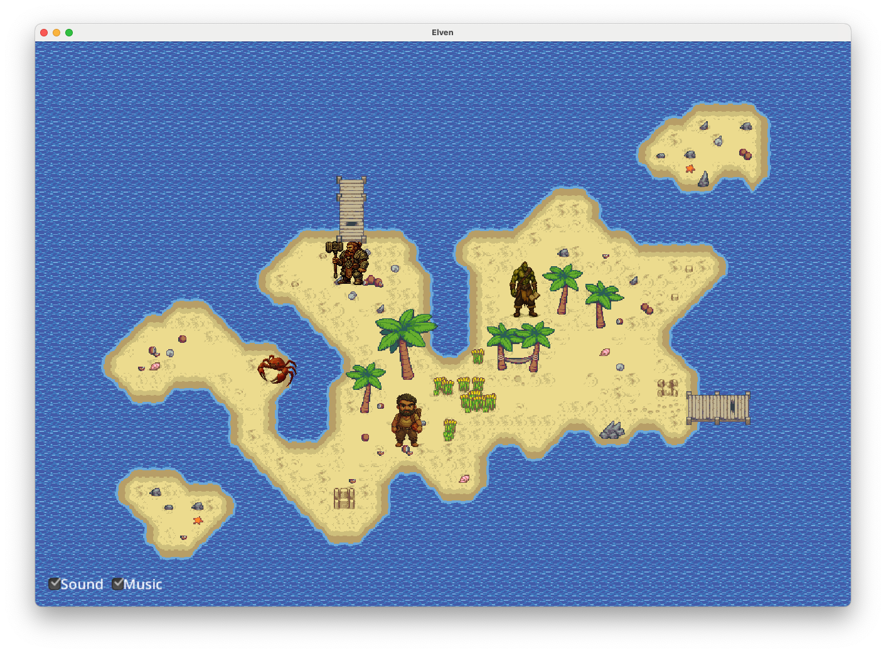

#  AI RPG Demo

[](https://github.com/kpavlov/elven/actions/workflows/gradle.yml)




---
A [libGDX](https://libgdx.com/) project generated with [gdx-liftoff](https://github.com/libgdx/gdx-liftoff).

It runs on desktop platform using LWJGL3/Kotlin/Langchain4J

## Project Overview

Elven is an AI-powered RPG (Role-Playing Game) demo built with libGDX, libKTX, Kotlin, and
Langchain4J/Langchain4J-Kotlin. The project demonstrates the integration of AI capabilities into a 2D game environment,
creating an interactive and dynamic gaming experience.

### Key Features

- **2D Game World**: Uses libGDX's orthographic camera and tiled maps for rendering a 2D game environment
- **Character System**: Includes both player-controlled and AI-controlled characters
- **Chat System**: Integrated chat functionality for character interactions
- **AI Agents**: Virtual Agent powered by LangChaing4J Services,
  featuring [RAG](https://docs.langchain4j.dev/tutorials/rag), [ChatMemory](https://docs.langchain4j.dev/tutorials/chat-memory),
  and [Tools](https://docs.langchain4j.dev/tutorials/tools) features.

### Technical Stack

- **Game Framework**: [libGDX](https://libgdx.com/), [linKtx](https://github.com/libktx/ktx)
- **Programming Language**: Kotlin
- **AI Integration
  **: [Langchain4J](https://github.com/langchain4j/langchain4j), [Langchain4j-Kotlin](https://github.com/kpavlov/langchain4j-kotlin)
- **Desktop Platform**: LWJGL3
- **Build System**: Gradle
- **Minimum JDK**: 22+

### Project Structure

- **core**: Main module with the application logic shared by all platforms
- **lwjgl3**: Primary desktop platform implementation
- **assets**: Game resources including maps, sprites, and audio files

## Platforms

- `core`: Main module with the application logic shared by all platforms.
- `lwjgl3`: Primary desktop platform using LWJGL3; was called 'desktop' in older docs.

## Prerequisites

Create `.env` file with your OpenAI API key:

```dotenv
OPENAI_API_KEY=sk-proj-...
```

## Gradle

This project uses [Gradle](https://gradle.org/) to manage dependencies.

Run it under JDK 22+ with:

```shell
./gradlew run
```
